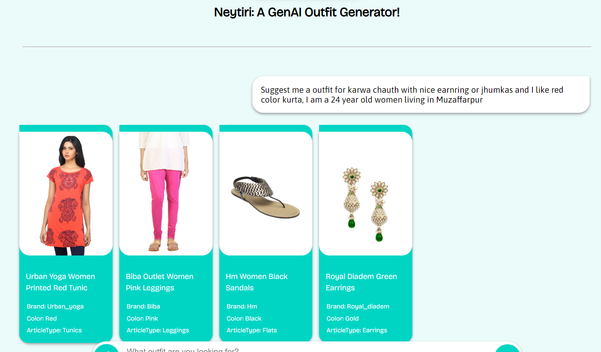
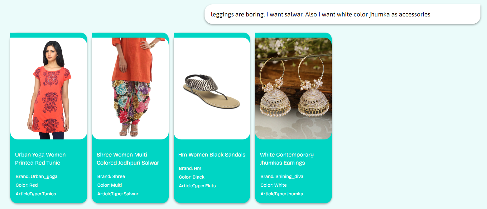
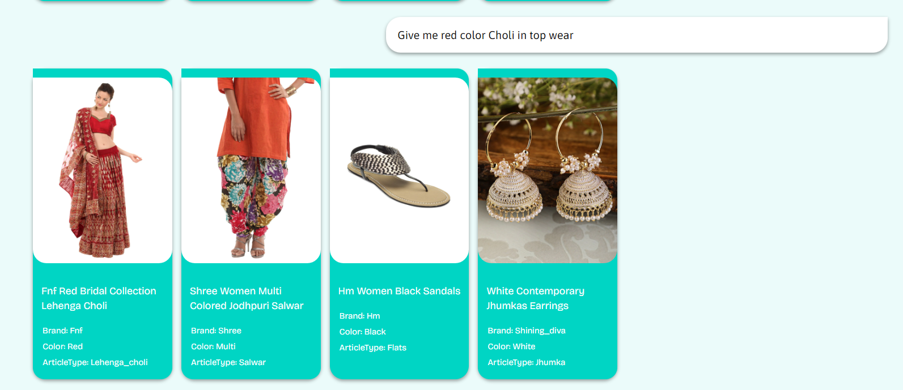
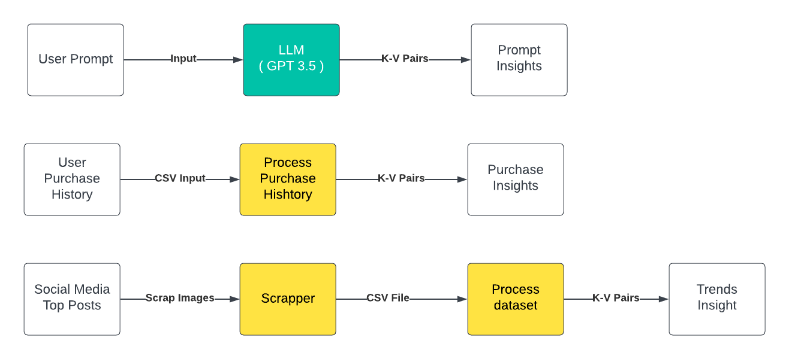
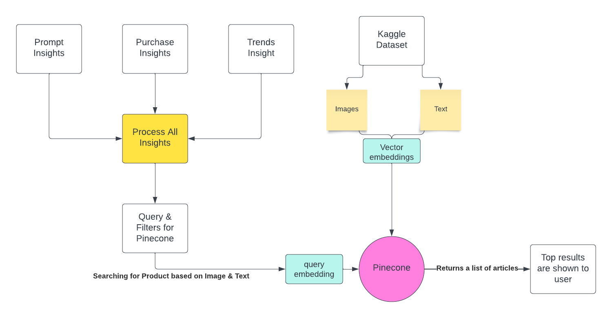

# **Flipkart Grid 5.0**

## **Problem Statement Title:** Conversational Fashion Outfit Generator powered by GenAI

## Tech Stack

1. Interface & Processing: OpenAI API,
2. Dataset: Refined an existing dataset picked up from Kaggle, can be found here: https://www.kaggle.com/datasets/paramaggarwal/fashion-product-images-dataset
3. Vector Database: Pinecone to store vector embedding of the products data of the kaggle dataset
4. Backend: Python FastAPI
5. Frontend: ReactJS

## **Team Name:** Tech Titans

### Problem statement

- Shift from traditional search to conversational fashion discovery.
- Need for personalized and trend-aligned outfit recommendations.
- Enhancing user experience and confidence in fashion choices.

### Solution

- Gen AI-powered fashion outfit generator.
- Analyses user preferences, purchase history, social media trends.
- Generates complete, well-coordinated outfits.

# How to setup-

### Backend:

navigate to the backend repository, create a virtual python enviroment.

`python -m venv env`

Activate the enviroment

`src/Scripts/activate`

Navigate to the file of requirements.txt and run
Install Backend dependancies using

`pip install -r requirements `

Navigate to the root backend directory and run the command of
`python server.py`
to start the FastAPI backend server.

### Env File

Create a .env file at the root director which should have the following variables-

`PINECONE_API_KEY = "fc0e7d98-b575-4842-9af2-619419ed1f50"
`

`PINECONE_ENVIRONMENT = "gcp-starter"
`

`OPEN_AI_API_KEY = "YOUR_API_KEY_HERE"
`

`USER_ID = os.getenv("YOUR_INSTAGRAM_ID_HERE")
`

`ACCESS_TOKEN = os.getenv("ACCESS_TOKEN_FOR_INSTAGRAM")`

_API Key for PineCone has been provided intentionally for developers to access the database where data for searchable products is stored._

### Frontend:

Navigate to the frontend folder and install the dependancies using

`npm install` command,
run the server locally using `npm start`

This will start your frontend server on the default `localhost:3000`

# Screenshorts:

User giving the first prompt for generating an ethnic outfit for "karwa chuth" occation.

User asking to change the leggings to salwar and color of jhumka

Changing the topwear outfit to Lehenga Choli

# How does it work?

User insights : Gathering insights about the user, before suggesting outfit.

Step 1: Insights from User Prompt :
Problem : Understanding what user wants from the prompt.
Solution : User’s prompt is processed to generate K-V pairs using OpenAI API to extract out
what the user actually wants.

Step 2: Insights from Purchase History:
Problem : Understanding User’s preference
Solution : By analysing the user purchase and view history, We identify user’s preference in
colours, brands, etc.

Step 3: Insights from Latest Fashion Trends:
Problem : Finding & identifying latest trends from social media.
Solution : Top trending fashion posts are scrapped from Instagram, Pinterest, etc. Which are
processed to generate a dataset, later stored in a CSV file.

Searching the VectorDB: The three type of insights generated in the previous step are combined to generate a query to be used for searching in pinecone

Step 4: Processing Insights:
Problem : We need to process K-V pairs from insights to form a usable search query for
pinecone
Solution : We combine the K-V pairs from the insights to generate search query & filters for
pinecone, later converted to embeddings for searching.

Step 5: Searching in Database:
Problem : Searching our database to find matching outfits for user query. Solution :. We upsert vector embeddings for both text & images of our dataset to Pinecone.
Embedding generated from query is searched on Pinecone. Now a multi modal search is
performed ( CLIP – for image embeddings, BM25 – to generate text embeddings)

Step 6: Serving user:
Problem : Serving the results through Backend
Solution : Using FastAPI to serve Pinecone search results to the user via a POST request.

Step 7: Incorporating the user requested outfit changes:
Problem: Making changes to the outfit according to the user’s changing prompt.
Solution: GPT API identifies what needs to be changed and based on that VectorDB is
searched again.

## **Glossary**

- **DB** : Database

- **K-V Pairs** : Key – Value pairs

- **CLIP** : Contrastive Language-Image Pretraining : is a neural network trained on a variety of (image, text) pairs. It can be instructed in natural language to predict the most relevant text snippet, given an image, without directly optimizing for the task, similarly to the zero-shot capabilities of GPT-2 and 3.

- **BM25** : Best Match 25 : A term based ranking model that aims to provide accurate and relevant search results by scoring documents based on their term frequencies and document lengths.

- **GPT** : Generative Pre-Trained. It is a Large Language Model developed by openAI.

## **Use-cases**

- ### **P0 : Personalized Outfit Recommendations**

  - Users receive tailored outfit suggestions based on what they have described in the prompt and their individual preferences, including style, color choices, and past purchase history.
  - The generator's analysis of user data ensures that every outfit recommendation aligns with the user's unique fashion taste.

- ### **P1 : Trend-Driven Fashion Discovery**

  - The outfit generator taps into social media trends and influencer styles to provide users with up-to-date fashion recommendations.
  - Users can stay current with the latest trends, ensuring that their outfits are both personalized and in line with the fashion zeitgeist.

- ### **P2 : Interactive Customization**

  - Users can engage in a conversational manner to provide feedback on recommended outfits.
  - The generator adapts based on user preferences, allowing them to tweak and modify outfits until they're satisfied.

## **Solution statement**

### Overall problem

Generating a personalized outfit based on user prompt, social media trends and user preferences.

### SUB-PROBLEMS

### User insights

Gathering insights about the user, before suggesting outfit.

- ### Step 1

  - **Insights from User Prompt :**
    - **Problem** : Understanding what user wants from the prompt.
    - **Solution** : User’s prompt is processed to generate K-V pairs using OpenAI API to extract out what the user actually wants.

- ### Step 2

  - Insights from Purchase History:
    - **Problem** : Understanding User’s preference
    - **Solution** : By analysing the user purchase and view history, We identify user’s preference in colours, brands, etc.

- ### Step 3

  - Insights from Latest Fashion Trends:
    - **Problem** : Finding & identifying latest trends from social media.
    - **Solution** : Top trending fashion posts are scrapped from Instagram, Pinterest, etc. Which are processed to generate a dataset, later stored in a CSV file.

### Searching the VectorDB

The three type of insights generated in the previous step are combined to generate a query to be used for searching in pinecone.

- ### Step 4

  - Processing Insights
    - **Problem** : We need to process K-V pairs from insights to form a usable search query for
      pinecone
    - **Solution** : We combine the K-V pairs from the insights to generate search query & filters for
      pinecone, later converted to embeddings for searching.

- ### Step 5

  - Searching in Database:
    - **Problem** : Searching our database to find matching outfits for user query.
    - **Solution** : We upsert vector embeddings for both text & images of our dataset to Pinecone. Embedding generated from query is searched on Pinecone. Now a multi modal search is performed ( CLIP – for image embeddings, BM25 – to generate text embeddings).

- ### Step 6

  - Serving user
    - **Problem** : Serving the results through Backend
    - **Solution** : Using FastAPI to serve Pinecone search results to the user via a POST request.

- ### Step 7

  - Incorporating the user requested outfit changes
    - **Problem**: Making changes to the outfit according to the user’s changing prompt.
    - **Solution**: GPT API identifies what needs to be changed and based on that VectorDB is
      searched again.

## **Limitations**

- **Limited dataset :**
  Currently our searchable dataset is limited(42K products only).

- **Static purchase history :**
  Currently the purchase history is static and is not updated automatically.

- **Scrapper & processing of trends data :** Our scrapper works only for Instagram and the processing of scrapped data to csv is done manually.

## **Future scope**

- **Virtual Try-On :**
  Virtual try-on allows you to see how clothes looks on the user before they buy it. It would use diffusion generative AI models like stable diffusion with control net to create photorealistic images of clothes on people with different body shapes, sizes, skin tones, and hair types.

- **Multi-Channel Integration:** Extending the outfit generator's functionality to other communication channels, such as messaging apps and voice assistants, can enhance user convenience and accessibility

- **Global Expansion:** Collaborating with fashion influencers, designers, and brands from around the world can help tailor the outfit generator's recommendations to diverse cultural and regional tastes.

- **Continuous Learning:** Building models that learn and adapt from user feedback and preferences over time can create a more personalized and accurate outfit recommendation experience.

# Team:

Ayush Yadav, Linkedin: https://www.linkedin.com/in/ayushunleashed/

Yashraj Shukla, Linkedin: https://www.linkedin.com/in/whynesspower/

Gobind Singh Maan, Linkedin: https://www.linkedin.com/in/gobind-singh-maan-2548a5157/
s

### More details can be found in the following PPT

https://docs.google.com/presentation/d/1BHmrGtab_Y8XDefpcobe4AwMa2MTJsMN/edit?usp=sharing&ouid=114849607912117448817&rtpof=true&sd=true
